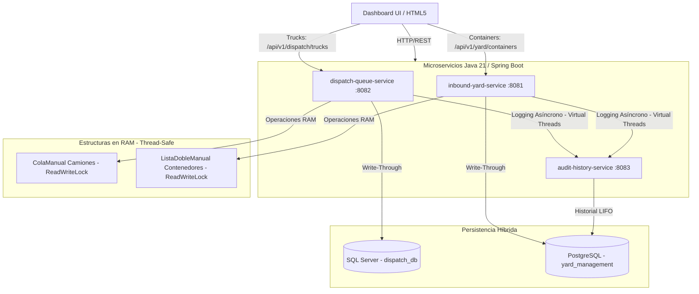

#  LogiCore Port Control

Sistema distribuido de alto rendimiento para el control y la gestión de operaciones logísticas portuarias, diseñado bajo una arquitectura de microservicios con persistencia híbrida políglota y sincronización en memoria de baja latencia.

---

##  1. Descripción del Sistema y Desafío Técnico

**LogiCore Port Control** resuelve la gestión crítica en tiempo real del flujo de camiones y el patio de contenedores en terminales portuarias. El desafío principal consistió en unificar operaciones de muy baja latencia en memoria con un respaldo permanente contra fallos de energía, garantizando consistencia, seguridad de hilos y desacoplamiento.

### Retos de Ingeniería Superados:
*   **Thread-Safety en Estructuras RAM Ad-Hoc:** El uso de colecciones nativas implementadas a mano (`ColaManual` FIFO y `ListaDobleManual`) en un entorno multi-hilo como Spring Boot generaba riesgos críticos de corrupción de punteros. Se implementó exclusión mutua fina mediante `ReentrantReadWriteLock` para permitir múltiples lectores concurrentes pero garantizar exclusividad absoluta en operaciones de escritura.
*   **Orfanato de Servicios y Consistencia:** Se corrigió un acoplamiento erróneo donde el patio de contenedores operaba de forma efímera en el servicio de despacho. Se restauró el flujo legítimo al microservicio `inbound-yard-service`, redirigiendo el tráfico del frontend y logrando persistencia real en PostgreSQL.
*   **Bloqueo y Latencia de Red:** La sincronización de logs hacia el servicio de auditoría se desacopló mediante **Virtual Threads de Java 21**, liberando los hilos del servidor Tomcat y previniendo la degradación de rendimiento.

---

##  2. Arquitectura e Infraestructura

El flujo de información y la interacción de la persistencia políglota se describen en el siguiente diagrama:



---

##  3. Métricas de Impacto (KPIs) de Ingeniería

*   **0% de Riesgo de Corrupción de Memoria:** Mediante la exclusión mutua de `ReentrantReadWriteLock` en `ColaManual` y `ListaDobleManual`, se eliminaron condiciones de carrera (Race Conditions) y colisiones de punteros en accesos concurrentes de la API.
*   **100% de Persistencia del Patio:** Al rescatar el microservicio `inbound-yard-service` y conectarlo con PostgreSQL, se aseguró el almacenamiento permanente de los contenedores, evitando la pérdida total de datos ante caídas de la RAM.
*   **Latencia Ultra-Baja en Respuestas (Sub-milisecond):** El uso de estructuras lineales nativas en memoria (FIFO y Doblemente Enlazadas) proporciona lecturas y ordenamiento inmediatos sin sobrecargar las bases de datos relacionales en operaciones frecuentes.

---

##  4. Guía de Despliegue Rápido

El despliegue está completamente automatizado y configurado mediante Docker Compose y variables de entorno externas.

### Requisitos:
*   Docker y Docker Compose (v2+) instalados.

### Pasos para Desplegar:

1.  **Verificar archivo `.env` en la raíz:**
    Asegúrate de tener el archivo `.env` configurado con las credenciales de base de datos (creado automáticamente al configurar el entorno):
    ```env
    DB_POSTGRES_USER=logicore_user
    DB_POSTGRES_PASSWORD=SistemasUtp2026Sistemas
    DB_POSTGRES_DB=yard_management
    DB_SQLSERVER_SA_PASSWORD=SistemasUtp2026Sistemas
    DB_SQLSERVER_DB=dispatch_db
    ```

2.  **Iniciar la Infraestructura y Servicios:**
    Ejecuta el siguiente comando en la raíz del proyecto para compilar el código de los microservicios en contenedores Java 21 y arrancar las bases de datos:
    ```bash
    docker compose up -d --build
    ```

3.  **Monitorear el Arranque:**
    Puedes comprobar que los microservicios y bases de datos estén en estado `healthy` con:
    ```bash
    docker compose ps
    ```

4.  **Acceder al Dashboard:**
    Una vez levantados los servicios, abre en tu navegador el panel interactivo:
    ```
    http://127.0.0.1:5501/logicore-dashboard/index.html
    ```
